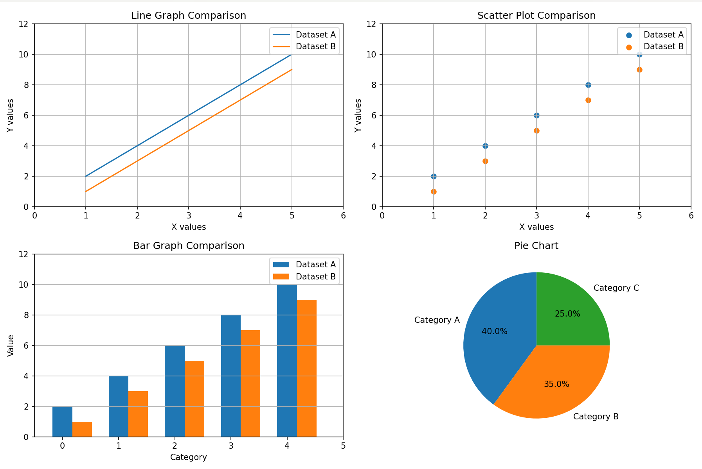
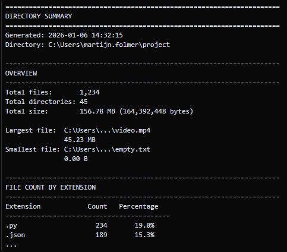
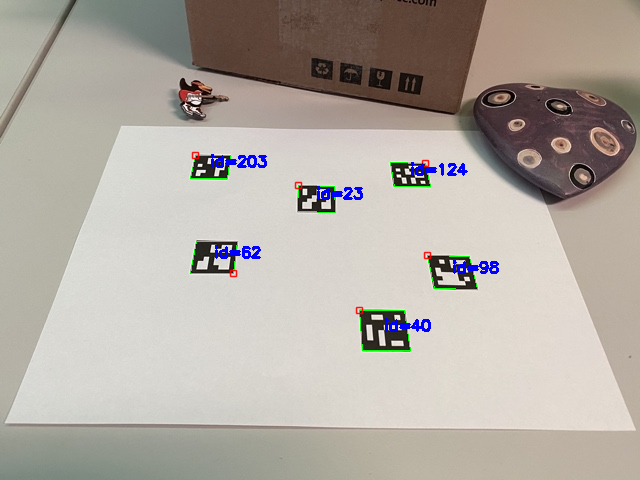
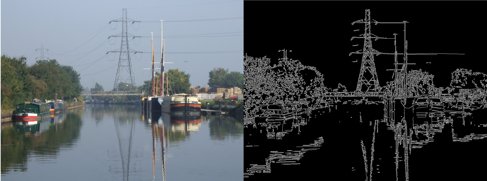
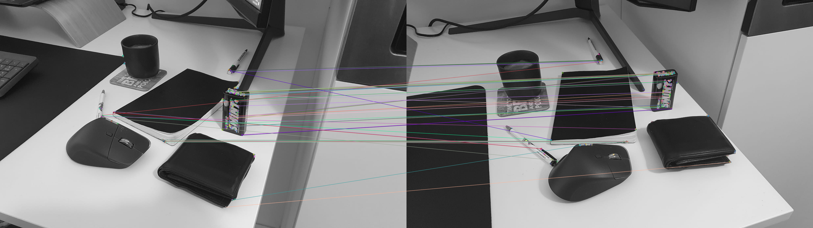

# Folmer_python_samples

A collection of practical python sample scripts. It is meant to be reusable, copy+pastable functions that I often use
in projects I'm working on. Feel free to use anything you find here in any way you like.

This is an ongoing process and I will be regularly adding to this repository

## Audio
### TrimWav.py
Shorten a .wav file by trimming the start and end of the audio file

## DataVisualisation
### 2DPlot.py
Different ways of plotting 2D data

## File Handling
### DeleteEverything.py
Delete a directory, including all files, directories, subdirectories, sub-subdirectories etc.

### DeleteFilesContainingSubstring.py
Deletes all files in a directory that have a particular substring in their name (ignores subfolders)

### DirectorySummary.py
Analyze a directory and generate a summary including total file count, total size, file count and size by extension, largest/smallest files. Outputs to console and saves to a txt file.

### MoveFilesToAnotherDirectory.py
Move all files (including subdirectories) to another directory

## Images

### ArucoMarkerDetection.py
Detection aruco markers in an image

### ConvertImagesToGrayscaleDir.py
Converts images from color to grayscale

### ConvertImagesTypeDir.py
Converts images from one format to another.

### EdgeDetection.py
Find the edges of an image using opencvs canny edge detection

### MosaicCreationFromDir.py
Create mosaics from random images in a directory

### ORBComparison.py
Compare 2 images using ORB to check for feature matching and alignment issues

### ResizeImagesDir.py
Converts images from one size to another.

### ResizeImagesMaxDimensionsDir.py
Resizes images that exceed maximum width/height limits while preserving aspect ratio. Images already within the specified dimensions are copied unchanged.

### StackImagesMultipleDir.py
Stack images from multiple directories based on matching filenames. Stacks horizontally or vertically, adds directory name labels above each image, and resizes as needed. If only one directory is provided, stacks all images in that directory together.

## Video

### ConcatenateVideos.py
Concatenates multiple videos into a single output video.

### ExtractClipFromVideoFromTimestamps.py
Takes a clip between two timestamps of a video and uses cv2 to extract the clip and save it somewhere else

### RepeatVideo.py
Repeats a single video multiple times in a row. Optional spatial cropping to extract a specific region of interest from each frame and optional trimming to skip frames from the beginning or end.

### StackVideo.py
Stacks multiple videos into one frame, either horizontally or vertically.

---

## Requirements

- Python 3.10+
- OpenCV (`pip install opencv-python`)
- NumPy 
- pydub (for audio processing)
- tqdm (for progress bars)
---

## Notes

- All scripts use hardcoded paths and settings inside `__main__` for clarity
- Modify paths and parameters directly in the script before running
- Designed for clarity over maximum performance. 
- Not all quality of life functionality exists over every script, so do not be alarmed if they for example have different verbose printing

Feel free to adapt or extend these samples for your own workflows.